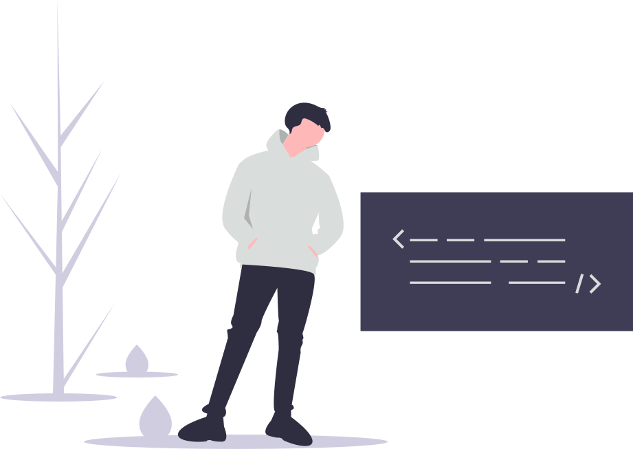

## Hey! I'm Alex 👋

I'm a high school senior passionate about technology and business. I enjoy experimenting with new languages and frameworks, exploring ideas in philosophy and psychology, and building fun things with cool people.

### Languages and Tools I Use

<!--**uyxela/uyxela** is a ✨ _special_ ✨ repository because its `README.md` (this file) appears on your GitHub profile.

Here are some ideas to get you started:

- 🔭 I’m currently working on ...
- 🌱 I’m currently learning ...
- 👯 I’m looking to collaborate on ...
- 🤔 I’m looking for help with ...
- 💬 Ask me about ...
- 📫 How to reach me: ...
- 😄 Pronouns: ...
- ⚡ Fun fact: ...
-->
